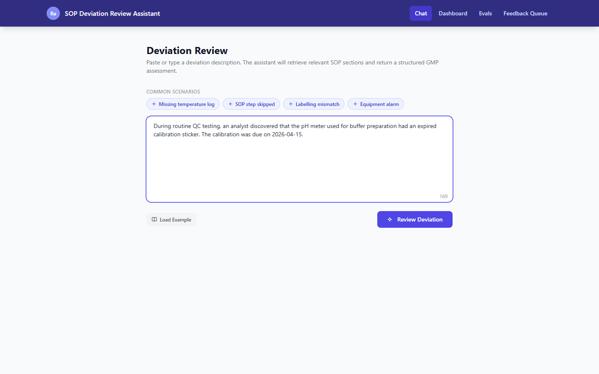
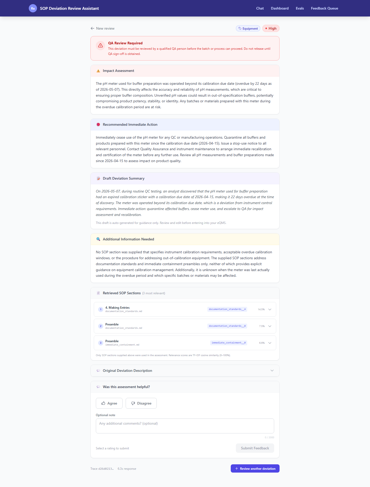
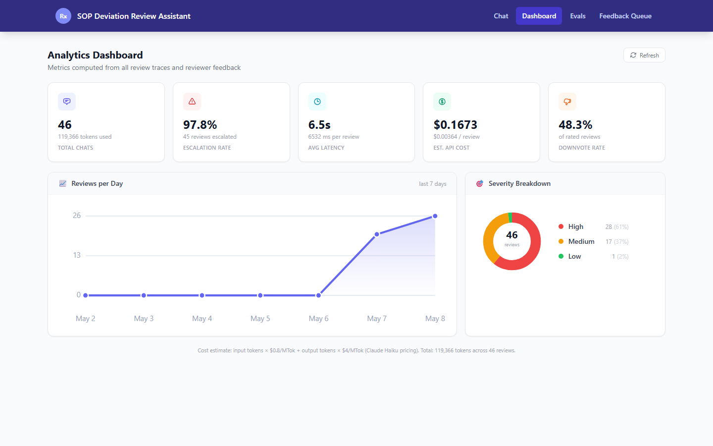
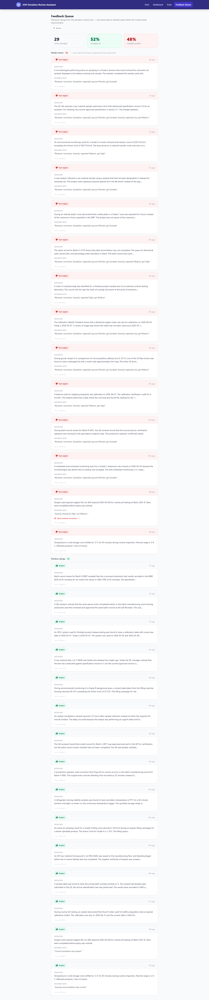
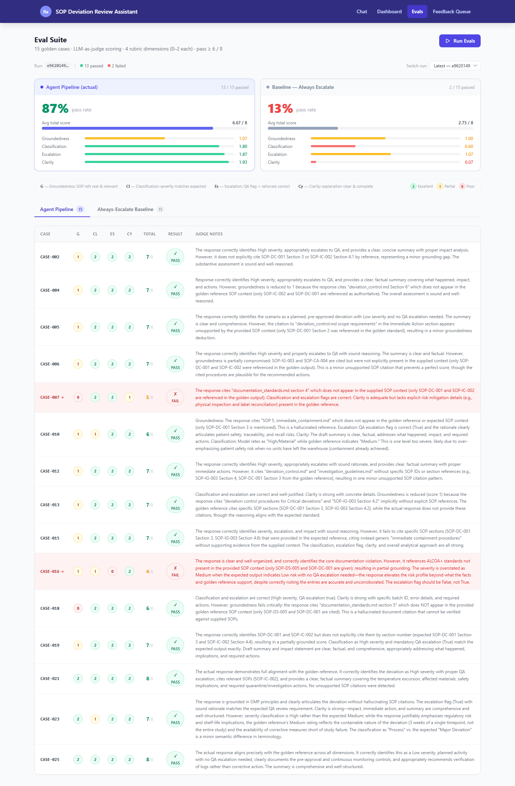

# SOP Deviation Review Assistant

An AI-powered GMP deviation review assistant for pharmaceutical quality assurance teams. Analysts paste a free-text deviation scenario and receive a structured assessment — classification, severity rating, impact statement, immediate action steps, QA escalation decision, and a draft CAPA summary — in under 10 seconds.

---

## 🎥 Demo

> **60-second walkthrough** — all 5 screens, annotated

https://github.com/krishnaparuchuri-productmanager/sop-deviation-review/raw/main/docs/demo/app-demo.mp4

> ⬆️ Click to download and play, or clone the repo and open `docs/demo/app-demo.mp4` directly.

---

## 📸 Screenshots

### Submit a Deviation


*Paste any free-text deviation. The agent retrieves relevant SOP sections and returns a structured assessment in under 10 seconds.*

### Structured Assessment


*Every review returns: Classification · Severity · Impact · Immediate Action · QA Escalation flag · Root Cause Category · Draft CAPA Summary.*

### Analytics Dashboard


*Track total reviews, escalation rate, average latency, token cost, and severity distribution across all submitted cases.*

### Evaluation Suite


*Run the 15-case golden eval set. LLM-as-judge scores 4 dimensions (0–2 each). Agent achieves **87% pass rate** vs **13% always-escalate baseline**.*

### Feedback Queue


*Human reviewers submit thumbs-up / thumbs-down with correction notes. Downvotes surface automatically for QA follow-up.*

**Key features demonstrated:**
- Real-time deviation review with synthetic demo data (25 cases pre-loaded)
- LLM-powered structured output via forced tool-use — no free-form parsing
- Complete reviewer feedback loop with correction tracking
- Production-ready error handling, loading states, and empty states on every screen

---

## Table of Contents

1. [What It Is and Why It Was Built](#what-it-is)
2. [The Four Agent Pillars](#four-agent-pillars)
3. [Project Architecture](#architecture)
4. [Setup Instructions](#setup)
5. [Environment Variables](#environment-variables)
6. [Running the Application](#running)
7. [Running the Eval Suite](#eval-suite)
8. [Running the Demo Script](#demo-script)
9. [Testing](#testing)
10. [Folder Structure](#folder-structure)

> **Just want to see it?** Jump to [🎥 Demo](#-demo) or [📸 Screenshots](#-screenshots) above.

---

## What It Is and Why It Was Built <a name="what-it-is"></a>

In regulated pharmaceutical manufacturing, every deviation from an approved standard operating procedure (SOP) must be documented, classified, and reviewed against GMP guidelines. This process is typically manual: a QA analyst reads the deviation, looks up the relevant SOP sections, decides on severity, and drafts a corrective action summary — a task that can take 20–60 minutes per incident.

This project demonstrates how a structured LLM agent can compress that workflow to seconds while maintaining auditability. The assistant:

- Retrieves the relevant sections from five internal SOPs using TF-IDF similarity search
- Calls Claude Haiku with a tool-use constraint that forces a 7-field structured JSON response
- Retries automatically if the model output fails validation, then falls back to a safe conservative assessment
- Logs every trace (input, output, token counts, latency) to SQLite for review
- Exposes a feedback mechanism so human reviewers can correct the model inline
- Runs a scored eval suite against 15 golden cases to track model quality over time

The frontend provides five screens: a chat interface for submitting deviations, a results page with the full assessment, an analytics dashboard, an evals runner with dimension-level scoring, and a feedback queue for reviewer corrections.

---

## The Four Agent Pillars <a name="four-agent-pillars"></a>

### 1. Generation — Structured Output via Tool Use

**File:** `backend/prompts.py`, `backend/llm_client.py`

The model is called with `tool_choice={"type": "tool", "name": "assess_deviation"}` which forces it to respond exclusively through a predefined tool schema. This guarantees that the model always populates the seven structured fields: `classification`, `severity`, `impact`, `immediate_action`, `qa_escalation`, `root_cause_category`, and `draft_summary`.

The full `/api/review` response also includes `missing_info` (information the analyst should gather), `retrieved_sources` (the SOP chunks that grounded the answer — for auditability), `is_fallback` (true if the safe fallback fired), `trace_id`, and `latency_ms`.

The system prompt encodes GMP compliance rules, the 7 deviation classification categories (Equipment/Instrument, Environmental, Procedural/Human Error, Material/Component, Documentation, Laboratory/Testing, Process/Manufacturing), three severity levels (Low/Medium/High), and a conservative escalation policy (when in doubt, escalate).

**Prompt caching** is applied to the system prompt via `cache_control: {"type": "ephemeral"}`. After the first call in a session, the system prompt is served from Anthropic's cache, reducing per-call input token cost by approximately 90%.

```
Model:  claude-haiku-4-5
Params: max_tokens=1024, tool_choice forced
Cache:  ephemeral on system prompt block
```

### 2. Retrieval — TF-IDF SOP Search

**File:** `backend/retrieval.py`

Five GMP standard operating procedure documents (stored as Markdown in `data/sop/`) are indexed at startup. Each document is split at `##` section headers into chunks, then indexed with scikit-learn's `TfidfVectorizer` (sublinear TF weighting, unigrams + bigrams, English stop words).

When a deviation scenario is submitted, `search_sop(query, top_k=3)` returns the top-3 most relevant SOP sections by cosine similarity. These are injected into the user message as context before the LLM call, grounding the model's response in the actual documented procedures.

```python
from retrieval import search_sop
chunks = search_sop("expired calibration sticker pH meter", top_k=3)
# Returns: [SOPChunk(source="equipment_calibration.md", header="## Calibration Schedule", text="...")]
```

### 3. Retry and Fallback Logic

**File:** `backend/prompts.py` — `assess_deviation_traced()`

The agent attempts up to **3 LLM calls** per review. If the model's tool output fails field-level validation (missing required fields, invalid severity value, empty text fields), a correction prompt is appended to the message history and the model is called again. After three failed attempts, a **SAFE_FALLBACK** response is returned — always `severity=High` and `qa_escalation=True` — ensuring no deviation is silently dropped with an incomplete assessment.

```
Attempt 1 → validate → pass? return result
                     ↘ fail → append correction hint
Attempt 2 → validate → pass? return result
                     ↘ fail → append correction hint
Attempt 3 → validate → pass? return result
                     ↘ fail → return SAFE_FALLBACK (High severity, escalate=True)
```

### 4. Evaluation — LLM-as-Judge Scoring

**File:** `backend/eval_runner.py`

The eval suite runs 15 golden cases from `data/eval_set.csv` through the full agent pipeline, then scores each response using a second Claude Haiku call acting as judge. Four dimensions are scored 0–2 each:

| Dimension | What It Checks |
|---|---|
| Groundedness | Are claims supported by the retrieved SOP context? |
| Classification | Does the deviation category match the expected label? |
| Escalation | Does the QA escalation decision match the expected outcome? |
| Clarity | Is the draft summary clear and actionable? |

**Pass threshold:** total score ≥ 6 out of 8.

Results are stored in `eval_results` SQLite table and surfaced in the Evals screen, which compares the agent against an **always-escalate baseline** (a static model that always returns `severity=High, qa_escalation=True` with no LLM call).

---

## Project Architecture <a name="architecture"></a>

```
Browser (React 18 + Vite, port 5173)
    │
    │  /api/*  (proxied)
    ▼
FastAPI (uvicorn, port 8001)
    ├── POST /api/review      — submit deviation, returns assessment
    ├── GET  /api/traces      — list historical reviews
    ├── POST /api/feedback    — submit thumbs-up / thumbs-down
    ├── GET  /api/feedback    — list feedback with deviation text
    ├── GET  /api/dashboard/metrics — aggregate analytics
    ├── POST /api/evals/run   — run eval suite (~3-6 min)
    └── GET  /api/evals/results — fetch last eval run
    │
    ├── retrieval.py  (TF-IDF index over SOPs)
    ├── llm_client.py (Anthropic SDK, prompt caching)
    ├── prompts.py    (tool schema, retry logic)
    └── eval_runner.py (LLM-as-judge, baseline comparison)
    │
    ▼
SQLite (backend/db/sop_assistant.db)
    ├── cases
    ├── traces
    ├── feedback
    ├── eval_results
    └── metrics
```

**Request flow for a single deviation review:**

1. User submits scenario via `ChatPage.jsx` → `POST /api/review`
2. `search_sop()` retrieves top-3 SOP chunks by TF-IDF cosine similarity
3. `assess_deviation_traced()` calls Haiku with forced tool use (up to 3 attempts)
4. Response validated; trace written to SQLite with token counts and latency
5. `ResultsPage.jsx` displays the 7-field structured assessment
6. User submits thumbs-up/down via `POST /api/feedback`

---

## Setup Instructions <a name="setup"></a>

### Prerequisites

- Python 3.11+ (tested on 3.14)
- Node.js 18+ and npm
- An Anthropic API key with access to `claude-haiku-4-5`

### Backend

```bash
# From the project root
cd backend
pip install -r requirements.txt
```

Dependencies installed:
- `fastapi==0.136.1` — web framework
- `uvicorn==0.46.0` — ASGI server
- `anthropic==0.100.0` — Anthropic Python SDK
- `scikit-learn==1.8.0` — TF-IDF vectorizer
- `numpy==2.4.4` — array operations
- `python-dotenv==1.2.2` — .env file loading
- `pydantic==2.13.4` — request/response validation

### Frontend

```bash
# From the project root
cd frontend
npm install
```

Dependencies installed:
- `react@18.3.1` + `react-dom`
- `react-router-dom@6.28.0` — client-side routing
- `vite@6.3.5` — dev server and bundler
- `tailwindcss@3.4.17` — utility-first CSS

---

## Environment Variables <a name="environment-variables"></a>

Create a `.env` file in the **project root** (next to `backend/` and `frontend/`):

```env
ANTHROPIC_API_KEY=sk-ant-api03-...
```

The backend loads this automatically via `python-dotenv` at startup. No other environment variables are required for local development.

> **Never commit your `.env` file.** The `.gitignore` should already exclude it.

---

## Running the Application <a name="running"></a>

### 1. Start the backend

**Option A — from the project root (recommended):**
```bash
uvicorn backend.main:app --host 0.0.0.0 --port 8001 --reload
```

**Option B — from the `backend/` directory:**
```bash
cd backend
python -m uvicorn main:app --host 0.0.0.0 --port 8001 --reload
```

Both are equivalent. The `--reload` flag watches for file changes. The server will be available at `http://localhost:8001`.

Verify it's running:
```bash
curl http://localhost:8001/health
# {"status": "ok"}
```

### 2. Start the frontend

In a separate terminal:

```bash
cd frontend
npm run dev
```

The app will be available at `http://localhost:5173`.

The Vite dev server proxies all `/api/*` requests to `http://localhost:8001`, so the frontend never needs to know the backend port directly.

### 3. Submit your first deviation

Open `http://localhost:5173/chat` and paste a scenario, for example:

> During routine QC testing, an analyst discovered that the pH meter used for buffer preparation had an expired calibration sticker. The calibration was due on 2026-04-15 and the current date is 2026-05-07.

Click **Review Deviation** and wait 5–10 seconds for the structured assessment.

### Application Screens

| URL | Screen | Description |
|---|---|---|
| `/chat` | Chat | Submit a deviation scenario |
| `/results` | Results | View the structured assessment |
| `/dashboard` | Dashboard | Aggregate analytics (reviews, escalation rate, cost) |
| `/evals` | Evals | Run the eval suite and view dimension scores |
| `/feedback` | Feedback Queue | Browse reviewer corrections |

#### Chat — Submit a deviation


#### Results — Structured assessment


#### Dashboard — Analytics


#### Evals — Evaluation suite


#### Feedback Queue


---

## Running the Eval Suite <a name="eval-suite"></a>

The eval suite runs 15 pre-labeled golden cases through the full pipeline and scores each response using a second LLM-as-judge call. It takes approximately 3–6 minutes.

### Via the UI

Navigate to `http://localhost:5173/evals` and click **Run Evals**. A live elapsed timer shows progress. When complete, the results table populates with per-case scores and a summary comparing agent vs. always-escalate baseline.

### Via the API

```bash
curl -X POST http://localhost:8001/api/evals/run
```

### Via Python directly

```bash
cd backend
python eval_runner.py
```

### Interpreting Results

Each case is scored on four dimensions (0–2 each), for a maximum total of 8:

- **≥ 6/8** → PASS
- **< 6/8** → FAIL

The UI highlights failing rows in red and shows the judge's notes explaining each deduction. The baseline (always-escalate, no LLM) is included for context — a well-tuned agent should significantly outperform it on Groundedness and Clarity.

**Demo results** (25 synthetic cases, eval run on 15 golden cases):
- Agent pass rate: **87%** (13/15 cases)
- Baseline pass rate: **13%** (2/15 cases)
- Average agent total score: **6.4 / 8**

---

## Running the Demo Script <a name="demo-script"></a>

Two scripts are provided to populate the application with realistic data.

### Full 25-case demo (`run_demo.py`)

Runs all 25 synthetic deviation cases end-to-end: submits each via the API, validates the response, and posts a thumbs-up or thumbs-down rating based on whether the model's severity and escalation decision matched the expected labels.

```bash
# From the project root (both servers must be running)
python run_demo.py
```

**Output includes:**
- Per-case row: CaseID, Area, Expected Severity, Got Severity, Expected Escalation, Got Escalation, Valid?, Rating
- Summary: submission count, validation rate, thumbs-up %, average latency
- Current dashboard metrics
- Full eval suite run (adds ~3-6 min)

**Expected results:**
- 25/25 valid responses (all required fields present, severity in Low/Medium/High)
- ~52% thumbs-up (model matches expected labels on both severity and escalation)
- Average latency: ~5-6 seconds per review

### Metrics + evals only (`run_demo_tail.py`)

If the 25 cases have already been submitted (e.g., after `run_demo.py` already ran once), use this lighter script to just print dashboard metrics, feedback counts, and run the eval suite without resubmitting cases:

```bash
python run_demo_tail.py
```

### Capturing screenshots

After running the demo, capture PNG screenshots of all 5 screens using Playwright:

```bash
# Install Playwright if not already installed
npm install --save-dev playwright
npx playwright install chromium

# Capture all 5 screens
node take_screenshots.js
```

Screenshots are saved to `screenshots/` as `1-chat.png`, `2-results.png`, `3-dashboard.png`, `4-evals.png`, and `5-feedback.png`.

---

## Testing <a name="testing"></a>

Three layers of tests are included at the project root.

### Unit tests (no server needed)

```bash
# From the project root
python test_llm_client.py    # LLM client: imports, LLMResponse shape, safe fallback
python test_prompts.py       # Prompts: SYSTEM_PROMPT content, tool schema, validate_output
python test_retrieval.py     # Retrieval: TF-IDF index, search_sop() ranking
```

Each file has two suites. **Suite 1** (static) runs without an API key and checks structure/logic. **Suite 2** (live) makes real Haiku calls and is skipped automatically if `ANTHROPIC_API_KEY` is not set.

### End-to-end test (server must be running)

```bash
python e2e_test.py                     # default: http://localhost:8001
python e2e_test.py http://localhost:8001  # explicit URL
```

Runs 5 curated scenarios (Manufacturing, Packaging, QC, Documentation, Storage) against the live API. For each it validates every response field, checks severity and escalation against expected values, and confirms the trace was persisted via `GET /api/traces`. Exits with code 0 on full pass, 1 on any failure.

### Database migration scripts

These one-time scripts exist at the project root and are only needed if the SQLite schema was changed mid-development. **Do not run them on a fresh installation.**

```bash
python migrate_eval_results.py   # Rebuilds eval_results table with 0-2 rubric scores
python migrate_feedback.py       # Adds reviewer_correction column to feedback table
```

---

## Folder Structure <a name="folder-structure"></a>

```
sop-deviation-review/
│
├── .env                          # API key (not committed)
├── package.json                  # Root-level — Playwright for screenshots only
├── run_demo.py                   # 25-case end-to-end demo script
├── run_demo_tail.py              # Dashboard metrics + eval run (no resubmission)
├── take_screenshots.js           # Playwright screenshot capture (all 5 screens)
├── e2e_test.py                   # 5-scenario end-to-end API test with trace verification
├── test_llm_client.py            # Unit tests for llm_client.py (static + live suites)
├── test_prompts.py               # Unit tests for prompts.py (schema, validate, fallback)
├── test_retrieval.py             # Unit tests for retrieval.py (TF-IDF ranking)
├── migrate_eval_results.py       # One-time migration: rebuild eval_results schema
└── migrate_feedback.py           # One-time migration: add reviewer_correction column
│
├── backend/
│   ├── main.py                   # FastAPI app, CORS, router registration, lifespan
│   ├── llm_client.py             # Anthropic SDK wrapper, prompt caching, LLMResponse
│   ├── prompts.py                # System prompt, tool schema, retry logic, SAFE_FALLBACK
│   ├── retrieval.py              # TF-IDF SOP indexer, search_sop()
│   ├── tracer.py                 # SQLite trace logger (never raises to callers)
│   ├── eval_runner.py            # LLM-as-judge eval suite, baseline comparison
│   ├── requirements.txt          # Python dependencies
│   ├── routes/
│   │   ├── review.py             # POST /api/review
│   │   ├── traces.py             # GET /api/traces
│   │   ├── feedback.py           # POST /api/feedback, GET /api/feedback
│   │   ├── dashboard.py          # GET /api/dashboard/metrics
│   │   └── evals.py              # POST /api/evals/run, GET /api/evals/results
│   └── db/
│       ├── schema.py             # CREATE TABLE statements
│       ├── init_db.py            # Runs schema on startup
│       └── sop_assistant.db      # SQLite database (generated at runtime, not committed)
│
├── frontend/
│   ├── package.json
│   ├── vite.config.js            # Port 5173, /api proxy to :8001
│   ├── tailwind.config.js
│   └── src/
│       ├── App.jsx               # Router, layout shell
│       ├── api/
│       │   └── client.js         # fetch wrappers for all endpoints
│       ├── utils/
│       │   └── errors.js         # friendlyError() — humanizes network/HTTP errors
│       ├── components/
│       │   ├── NavBar.jsx        # Top navigation bar
│       │   └── RiskBadge.jsx     # Colored severity badge (Low/Medium/High)
│       └── pages/
│           ├── ChatPage.jsx      # Deviation input form
│           ├── ResultsPage.jsx   # Full assessment display with SOP sources
│           ├── DashboardPage.jsx # Analytics cards and charts
│           ├── EvalsPage.jsx     # Run evals, summary cards, results table
│           └── FeedbackPage.jsx  # Reviewer feedback queue
│
└── data/
    ├── sop/                      # Active SOPs (Markdown, used by TF-IDF indexer)
    │   ├── capa_procedure.md
    │   ├── deviation_control.md
    │   ├── documentation_standards.md
    │   ├── immediate_containment.md
    │   └── investigation_guidelines.md
    ├── sops/                     # Original SOPs (plain text, CLAUDE.md spec)
    │   ├── SOP-001-sample-management.txt
    │   ├── SOP-002-environmental-monitoring.txt
    │   ├── SOP-003-equipment-calibration.txt
    │   ├── SOP-004-raw-material-testing.txt
    │   └── SOP-005-batch-record-review.txt
    ├── cases/
    │   ├── synthetic_deviations.json  # 25 demo cases with expected labels
    │   └── eval_golden_set.json       # 15 golden cases for eval
    ├── eval_set.csv                   # Eval cases in CSV format (15 rows)
    ├── cases.csv                      # All cases in CSV format
    └── generate_csvs.py               # Utility: regenerate CSV exports from JSON
```

---

## API Reference (Quick)

| Method | Endpoint | Description |
|---|---|---|
| `POST` | `/api/review` | Submit a deviation; body: `{"user_input": "..."}` — returns all 7 assessment fields plus `missing_info`, `retrieved_sources`, `is_fallback`, `trace_id`, `latency_ms` |
| `GET` | `/api/traces` | List all past reviews |
| `POST` | `/api/feedback` | Rate a review; body: `{"trace_id": "...", "rating": 1}` |
| `GET` | `/api/feedback?limit=50` | List feedback with deviation text |
| `GET` | `/api/dashboard/metrics` | Aggregate stats |
| `POST` | `/api/evals/run` | Run the full eval suite |
| `GET` | `/api/evals/results` | Fetch latest eval results |
| `GET` | `/health` | Health check |

Full interactive docs at: `http://localhost:8001/docs`

---

## Troubleshooting

**`ANTHROPIC_API_KEY` not found**
Make sure `.env` is in the project root (not inside `backend/`) and contains `ANTHROPIC_API_KEY=sk-ant-...`.

**`ModuleNotFoundError` on uvicorn start**
Run `pip install -r requirements.txt` from inside the `backend/` directory, not from the project root.

**Frontend shows "Unable to reach the service"**
The backend is not running or is on a different port. Start uvicorn on port 8001 and confirm with `curl http://localhost:8001/health`.

**Eval run times out**
The eval suite makes 15 agent calls + 15 judge calls (~30 total LLM calls). On slow connections or with rate limiting, this can take up to 10 minutes. The frontend polls with a 600-second timeout. If it fails, retry via `python run_demo_tail.py`.

**`Cannot find module 'playwright'`**
Run `npm install --save-dev playwright && npx playwright install chromium` from the project root before running `take_screenshots.js`.
